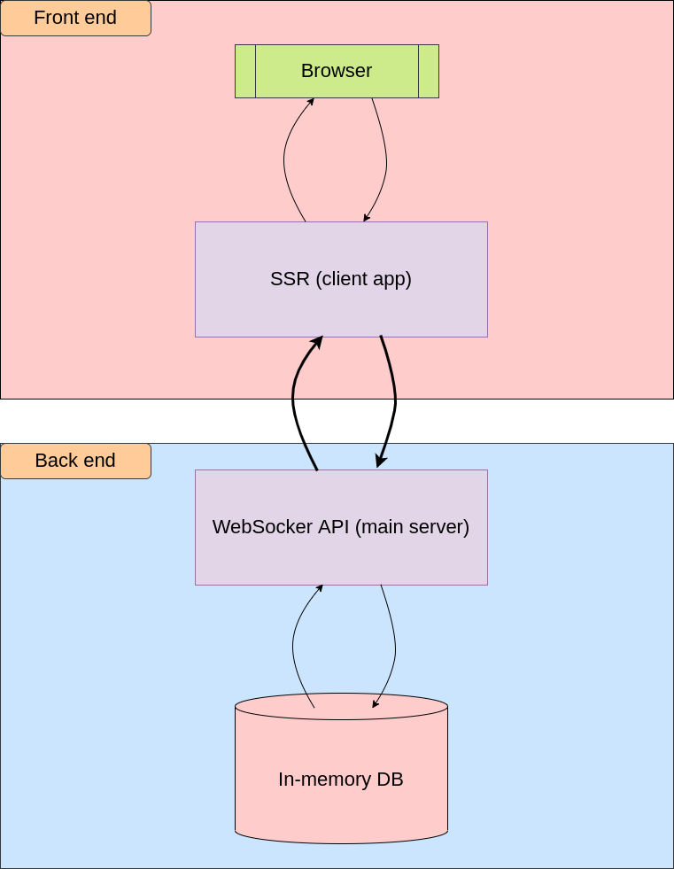

# Domino Game. Design Document

## Context & scope

The Domino Game gives opportunity to play classic (traditional) domino via browser. A user can create game session on their own or just join an existing one using a given session link. If the user creates session they need to specify a finish score and players count and get a session url after. Then the user can share this link with other players to join.
This type of domino requires from 2 to 4 payers. The game begins by setting the heaviest domino. Then after the found player makes the first move the round begins. Players make theirs move clockwise. A player may only play a tile which has upon it a number showing at one end of domino end or the other.
There are two option for the end of the round:
  + when one player places his last domino;
  + when no players can proceed, then a winner is a players whoose combined sum of all spots on their remaining dominos is the least;

The winner of a current round scores the sum of all spots on the loosers' remaining tiles. The game continues till somesome gains the predefined score.

## Goals & non-goals

**Goals:**
  + session creation for 2-4 players;
  + option to join via a link;
  + access via browser client;

**Non-goals:**
  + account creation (sign in/up optiuons);
  + playing with AI;
  + entering own nicknames for session;
  + access via browser, desktop client;

## The actual design

An architecture must contain websocket server to handle play sessions using in-memory db for storing some session data (like score, round count etc.) and a server-side rendering client to grant access to playground to users.

### System-context-diagram

Technical landscape should look like:

