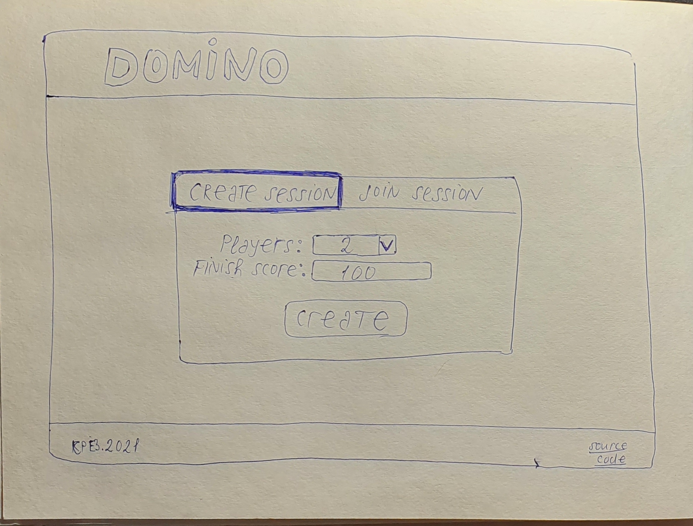
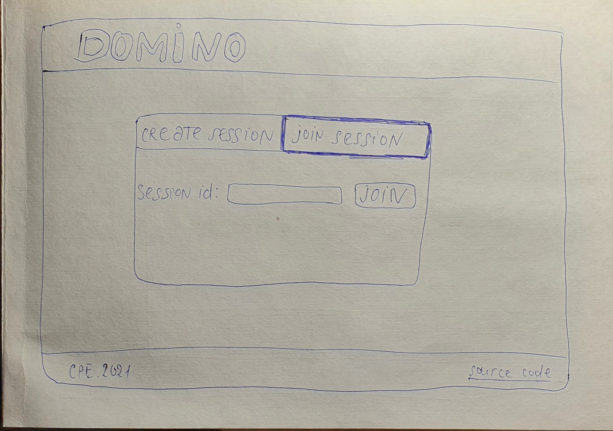
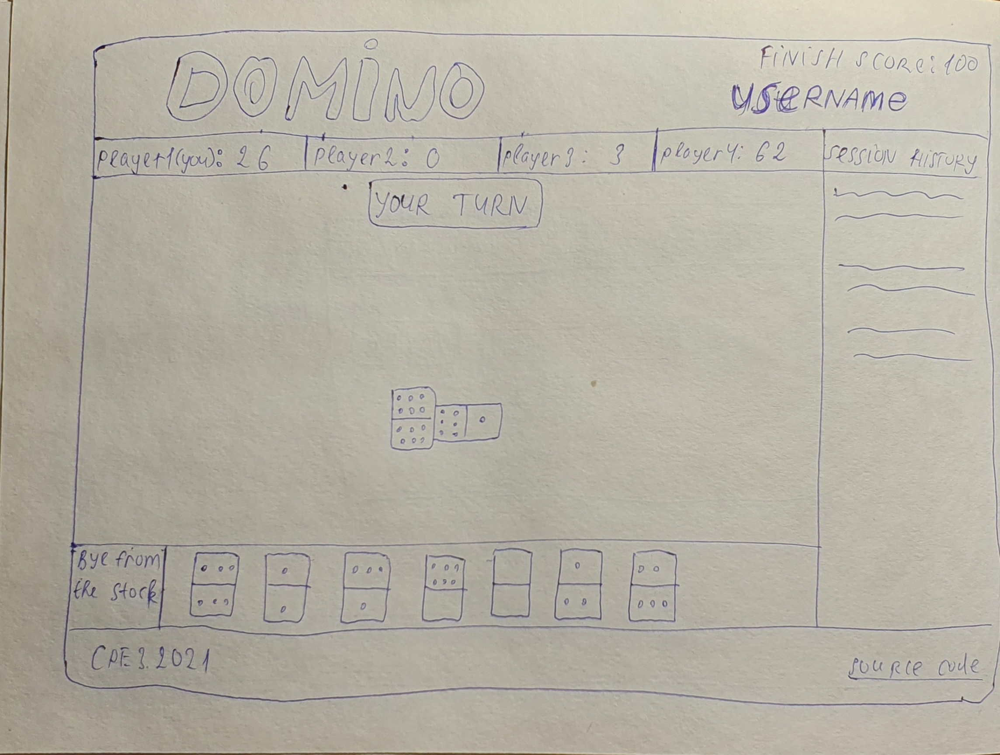
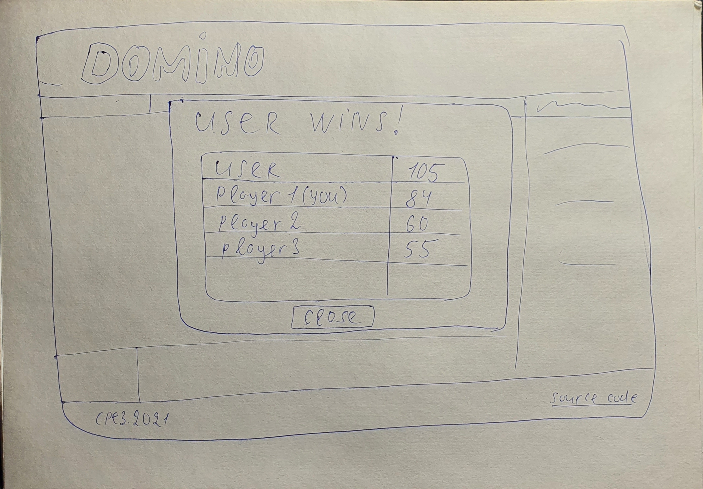

# Domino Game. Design Document

## Context & scope

The Domino Game gives the opportunity to play classic (traditional) domino via browser. A user can create a game session on their own or just join an existing one using a given session link. If the user creates the session they need to specify a finish score and players count and get a session url after. Then the user can share this link with other players to join.
This type of domino requires 2-4 players. The game begins by setting the heaviest domino. Then after the found player makes the first move the round begins. Players make theirs move clockwise. A player may only play a tile which has upon it a number showing at one end of the domino chain or the other.
There are two option for the end of the round:
  + when one player places his last domino;
  + when no players can proceed, then a winner is a players whose combined sum of all spots on their remaining dominos is the least;

The winner of a current round scores the sum of all spots on the loosers' remaining tiles. The game continues till someone gains the predefined score.

## Goals & non-goals

**Goals:**
  + session creation for 2-4 players;
  + option to join via a link;
  + access via browser client;

**Non-goals:**
  + account creation (sign in/up options);
  + playing with AI;
  + entering own nicknames for session;
  + access via mobile, desktop client;

## The actual design

An architecture must contain a websocket server to handle play sessions using in-memory db for storing some session data (like score, round count etc.) and a server-side rendering client to grant access to the playground to users.

### System-context-diagram

Technical landscape should look like:

### APIs

Designed API should allow to select the quantity of players and final score, then send this data to the server requesting the session URL. After getting the URL, the user enters the session and is allowed to share this link. Other invitee players are able to enter the link and access the session. The client should respond to players' actions, meanwhile the server handles game rules and manages game results.

### Data storage

System must store temporary information about the session (room) state like score, rounds, moves. It also should contain user nicknames and their dice.

## Alternatives considered

Considering alternative realizations, the client side has some.

Firstly, client-side rendering can be used instead of server-side one. But this approach would lead to the single-page application that contains all game logic at once, including session creation and joining mixed up with playground.

Secondly, there is an option to create a cross-platform desktop client using Unity, for example. But this approach is more time and resource-consuming, and it would be necessary to consider all the device types.

The only alternative for the server-side websocket usage is to send HTTP requests, but this solution is not as productive because the game requires real-time connection. Websockets allow more efficient management of game sessions.

Similar logic applies to the choice of in-memory database. Usage of SQL-database is unnecessary as the amount of data to be stored is small, temporary and need to be managed fast. In-memory databases are better suited to the concept of a real-time game.

## Cross-cutting concerns

Extreme security measures are not relevant in this case as the game sessions are temporary. Besides, the system doesn't provide storage of any kind of personal data such as account creation. All of the game logic is placed on the server side, and there is no option to cheat the system because everything is calculated and stored in one place (server).

## Implementation details

**NextJS** framework implements server-side rendering with the use of React components. In order to be more minimalistic it is preferable to use JS instead of TypeScript. Redux will be used for centralized storage of player's data.

As for the server side, **NestJS** is going to be used for layers configuration. It is needed to separate a websocket server for the game and session management (the first one is implemented using websocket connection, the second - via HTTP requests). **Redis** will be used as an in-memory database for storing session data.

## Development stages

**Server development:**
  1. Game logic - domino rules;
  2. Websocket server;
  3. Session manager and database implementation;

**Client development:**
  1. Player interface
  2. Websocket connection
  3. Session creation/entry

## User interface concepts

Game menu (create/join session):

Playground (during session):

Game score (after session):

